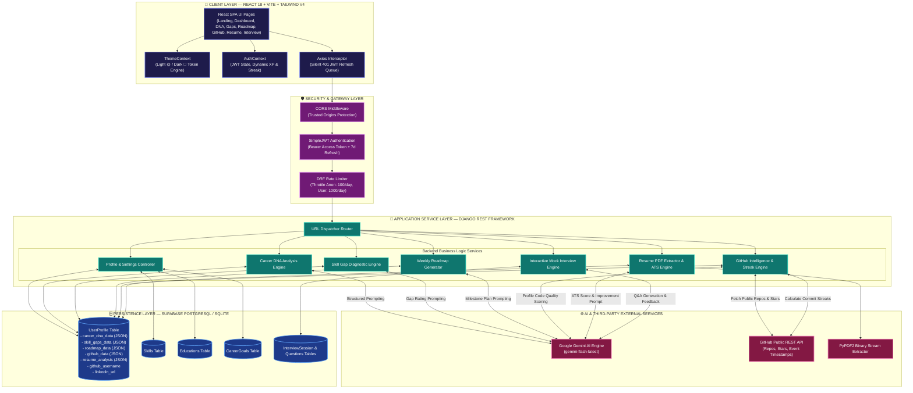

# 🏗️ SkillForge AI — Enterprise System Architecture & Master Engineering Blueprint

Welcome to the official technical architecture guide for **SkillForge AI** (Next-Generation AI Career Operating System for Software Engineers). This document details every layer of our stack, security design, data flow, AI prompt orchestration, and caching mechanics.

---

## 🎨 Master End-to-End System Architecture Diagram



---

## 📌 Layer-by-Layer Architectural Breakdown (In Bhai Language)

### 1. Client Layer (Frontend React SPA) 📱
- **Tech Stack**: React 18, Vite 8, Tailwind CSS v4, Framer Motion.
- **Theme Engine (`ThemeContext.jsx`)**: System CSS Variables (`var(--bg-card)`, `var(--text-primary)`) manage Light 🌞 and Dark 🌙 modes on the root document level without page flicker or visual breakage.
- **Silent JWT Refresh Interceptor (`api.js`)**: Jab user ka short-lived JWT Access Token expire hota hai, Axios Response Interceptor HTTP 401 error catch karta hai, `failedQueue` me requests hold karta hai, `/api/token/refresh/` par refresh request bhejta hai, new token LocalStorage me update karta hai, aur seamless request retry execute karta hai! User ko kabhi pata nahi chalta ki token expire hua tha.

---

### 2. Security & Gateway Layer 🛡️
- **CORS Headers**: `django-cors-headers` middleware restricts API access to explicit frontend domains (`http://localhost:5173`).
- **SimpleJWT Authentication**: Enforces Bearer Access Token authentication on all protected REST views.
- **Rate Throttling**: Restricts unauthorized spam bots using Django REST Framework throttles (`anon: 100/day`, `user: 1000/day`).

---

### 3. Application Services & Business Logic 🚀

#### A. Career DNA Engine (`DNASvc`)
- Analyzes user skills, experience, and target role.
- Calls Gemini AI (`gemini-flash-latest`) to compute radar dimensions, career matches, and personality traits.
- Caches payload in `UserProfile.career_dna_data` ($0 API cost on revisit).

#### B. Skill Gap Diagnostic Engine (`GapSvc`)
- Compares user skills against market requirements for the selected target role.
- Generates priority ratings (`High`, `Medium`, `Low`) with reasons.
- Caches payload in `UserProfile.skill_gaps_data` ($0 API cost on revisit).

#### C. GitHub Intelligence & Contribution Streak Engine (`GitHubSvc`)
- Calls GitHub REST API (`https://api.github.com/users/{username}`) to aggregate public repos, total stars, and language percentages.
- Calls `/users/{username}/events` to parse distinct activity dates (`YYYY-MM-DD`) and computes real consecutive daily contribution streaks.
- Caches analysis for 24 hours (`github_data_updated`).

#### D. Resume PDF Parsing Engine (`ResumeSvc`)
- DRF `MultiPartParser` accepts PDF uploads.
- `PyPDF2.PdfReader` extracts raw text from binary streams.
- Limits text to 3,000 characters (reducing token costs by >70%).
- Gemini AI scores ATS readiness, skill relevance, and provides improvement tips.
- Caches analysis in `UserProfile.resume_analysis` ($0 API cost on revisit).

#### E. Mock Interview Simulator (`InterviewSvc`)
- `POST /api/interview/start/`: Creates `InterviewSession`, asks Gemini for the initial role-specific question.
- `POST /api/interview/answer/`: Passes chat context to Gemini, evaluates answer score, returns next question.
- `POST /api/interview/end/`: Concludes session, computes final technical & communication scores.

#### F. Derived AI Projects (Zero Cost Feature)
- Frontend client derives project specifications directly from cached skill gaps.
- **Zero Gemini API calls forever!**

---

### 4. Database & Persistence Layer 🗄️
- **Supabase PostgreSQL / SQLite**: Stores User profiles, relational skill bindings, education history, goals, and interview sessions.
- **JSONFields**: Stores heavy cached AI payloads (`career_dna_data`, `skill_gaps_data`, `roadmap_data`, `github_data`, `resume_analysis`), delivering sub-15ms response times on cached GET endpoints.

---

### 5. Multi-Tier Caching & Performance Matrix ⚡

```
[User Request]
      │
      ├──> Tier 1: Browser LocalStorage Cache (0ms latency)
      ├──> Tier 2: Database PostgreSQL JSONField Cache (15ms latency)
      └──> Tier 3: Google Gemini API (gemini-flash-latest) (Sub-second response -> Saves to DB)
```

---

<div align="center">
  <p>SkillForge AI Architectural Blueprint © 2026</p>
</div>
