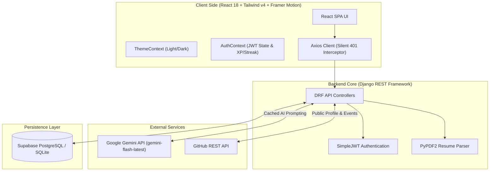

<div align="center">

  # ⚡ SkillForge AI
  ### Next-Generation AI Career Operating System for Software Engineers

  [](https://www.python.org/)
  [](https://www.djangoproject.com/)
  [](https://react.dev/)
  [](https://ai.google.dev/)
  [](https://tailwindcss.com/)
  [](https://vitejs.dev/)
  [](https://www.docker.com/)

  <p align="center">
    <strong>SkillForge AI</strong> is an autonomous, full-stack AI career operating system built for software developers, engineers, and CS students. It evaluates your multidimensional skills, parses PDF resumes for ATS scoring, aggregates public GitHub commit evidence, generates skill-targeted project blueprints, and conducts interactive AI mock interviews.
  </p>

  [Features](#-all-features) • [System Architecture](#-system-architecture) • [Run on Your Machine](#-how-to-run-on-your-machine) • [API Reference](#-api-reference) • [Curriculum Notes](#-curriculum-notes-days-126)

</div>

---

## 🔥 All Features

### 1. 🧬 Career DNA Analysis Engine
- **Multidimensional Mapping**: Evaluates your known languages, frameworks, and experience levels against target roles (Backend, Full Stack, AI Engineer).
- **Match Breakdown**: Calculates match percentage, personality profile tags, strengths, and growth recommendations.
- **Smart DB Caching**: Result cached in `UserProfile.career_dna_data` (0 API calls on repeat visits).

### 2. ⚡ Skill Gap Diagnostics
- **Market Comparison**: Compares your skills against real industry requirements for senior and mid-level roles.
- **Priority Ratings**: Categorizes missing skills into `High`, `Medium`, and `Low` priority targets with clear explanations.

### 3. 🐙 GitHub Intelligence & Contribution Streak
- **Public API Aggregation**: Fetches public repositories, stargazers count, and top language distributions.
- **Real Commit Streak Engine**: Analyzes public GitHub event timestamps (`/users/{username}/events`) to compute continuous daily contribution streaks.
- **24-Hour Cache**: Results cached for 24 hours in DB (`github_data_updated`) to respect API rate limits.

### 4. 📄 Resume ATS Engine & PDF Extractor
- **PyPDF2 Binary Parsing**: Accepts PDF resumes, extracts raw text, and limits payloads to 3,000 characters to optimize token usage.
- **Gemini ATS Scoring**: Scores resume formatting, ATS readiness, keyword density, and produces bullet-point improvement tips.

### 5. 🎤 Interactive AI Mock Interview Simulator
- **Role-Specific Interviews**: Select Target Role, Difficulty (Easy, Medium, Hard), and Type (Technical, Behavioral, System Design).
- **Real-Time Evaluation**: Generates single questions, evaluates user answers dynamically, and scores technical accuracy and clarity.

### 6. 🛠️ Skill-Targeted Derived AI Projects (Zero Cost)
- **Zero API Expense**: Projects are derived 100% locally on the client from your real skill gaps.
- **Actionable Blueprints**: Every project includes difficulty tags, estimated completion hours, and step-by-step milestones.

### 7. 🗺️ Personalized Learning Roadmap
- **Weekly Milestones**: Connects course studies, hands-on builds, and proof tasks in a 4-week timeline tailored to your career goal.

### 8. 🎨 Global Design System & Light/Dark Mode
- **Token-Based Theming**: Seamless switching between Light Mode 🌞 and Dark Mode 🌙 via `ThemeContext` and CSS custom properties (`var(--bg-card)`, `var(--text-primary)`).
- **Framer Motion Micro-animations**: Smooth entrance transitions, animated counters, and SVG score progress rings.

---

## 🏗️ System Architecture



---

## 💻 How to Run on Your Machine

You can run SkillForge AI using either **Standard Local Setup** or **Docker Setup**.

---

### Method A: Standard Local Setup (Recommended for Development)

#### 1. Clone the Repository
```bash
git clone https://github.com/your-username/SkillForge-AI.git
cd SkillForge-AI
```

#### 2. Backend Setup (Django REST Framework)
```bash
# Navigate to backend directory
cd backend

# Create Python virtual environment
python3 -m venv venv

# Activate virtual environment
# On macOS/Linux:
source venv/bin/activate
# On Windows:
# venv\Scripts\activate

# Install Python dependencies
pip install -r requirements.txt

# Create .env file inside backend directory
cat <<EOT > .env
SECRET_KEY=django-insecure-development-key-change-in-production
DEBUG=True
GEMINI_API_KEY=your_google_gemini_api_key_here
EOT

# Run Database Migrations
python manage.py makemigrations
python manage.py migrate

# Start Django Development Server
python manage.py runserver
```
Backend server will run at: **`http://127.0.0.1:8000/`**

#### 3. Frontend Setup (React + Vite)
Open a new terminal window:

```bash
# Navigate to frontend directory
cd frontend

# Install Node dependencies
npm install

# Start Vite Development Server
npm run dev
```
Frontend app will run at: **`http://localhost:5173/`**

---

### Method B: Docker Setup (Recommended for Production / 1-Click Launch)

#### Prerequisites
- Install [Docker Desktop](https://www.docker.com/products/docker-desktop/)

#### Steps
```bash
# In the root directory, create .env file
cat <<EOT > .env
GEMINI_API_KEY=your_google_gemini_api_key_here
EOT

# Build and start both Backend & Frontend containers
docker-compose up --build
```
- Access Frontend UI: **`http://localhost:5173`**
- Access Backend API: **`http://localhost:8000`**

---

## 📑 API Reference

| Method | Endpoint | Description | Auth Required |
|---|---|---|---|
| `POST` | `/api/register/` | Register new user account | No |
| `POST` | `/api/login/` | JWT token login (`access` + `refresh`) | No |
| `POST` | `/api/token/refresh/` | Refresh access token | No |
| `GET` | `/api/myprofile/` | Fetch current user profile & dynamic stats | Yes |
| `GET` | `/api/carrer-dna/` | Fetch or generate Career DNA analysis | Yes |
| `GET` | `/api/skills_gap/` | Fetch or generate Skill Gap analysis | Yes |
| `GET` | `/api/roadmap/` | Generate learning roadmap | Yes |
| `POST` | `/api/github/link/` | Link GitHub username | Yes |
| `GET` | `/api/github/analyze/` | Fetch GitHub repo stats & AI score (24h cache) | Yes |
| `POST` | `/api/resume/upload/` | Upload PDF resume for PyPDF2 text extraction & Gemini scoring | Yes |
| `GET` | `/api/resume/analysis/` | Get cached resume analysis | Yes |
| `POST` | `/api/interview/start/` | Start AI mock interview session | Yes |
| `POST` | `/api/interview/answer/` | Submit interview answer & receive AI evaluation | Yes |
| `POST` | `/api/interview/end/` | End interview session & get final scorecard | Yes |

---

## 📚 Curriculum Notes (Days 1–26)

The project includes a complete 26-day backend & frontend engineering curriculum written in **Hinglish ("Bhai Language")** with real-world analogies and **10 technical interview questions per day**:

- 📄 [Day 1: Database and Admin](file:///Users/rajchaudhary/createmindai/CareerMind-A/notes/Day_1_Database_and_Admin.md)
- 📄 [Day 2: Serializers](file:///Users/rajchaudhary/createmindai/CareerMind-A/notes/Day_2_Serializers.md)
- 📄 [Day 3: PUT, PATCH, DELETE](file:///Users/rajchaudhary/createmindai/CareerMind-A/notes/Day_3_PUT_PATCH_DELETE.md)
- 📄 [Day 4: Authentication JWT](file:///Users/rajchaudhary/createmindai/CareerMind-A/notes/Day_4_Authentication_JWT.md)
- 📄 [Day 5: Registration API](file:///Users/rajchaudhary/createmindai/CareerMind-A/notes/Day_5_Registration_API.md)
- 📄 [Day 6: Advanced Relationships](file:///Users/rajchaudhary/createmindai/CareerMind-A/notes/Day_6_Advanced_Relationships.md)
- 📄 [Day 7: React Basics](file:///Users/rajchaudhary/createmindai/CareerMind-A/notes/Day_7_React_Basics.md)
- 📄 [Day 8: Frontend Auth JWT](file:///Users/rajchaudhary/createmindai/CareerMind-A/notes/Day_8_Frontend_Auth_JWT.md)
- 📄 [Day 9: Advanced Frontend Integration](file:///Users/rajchaudhary/createmindai/CareerMind-A/notes/Day_9_Advanced_Frontend_Integration.md)
- 📄 [Day 10: AI Integration Architecture](file:///Users/rajchaudhary/createmindai/CareerMind-A/notes/Day_10_AI_Integration_Architecture.md)
- 📄 [Day 11: Final Architecture and Interview](file:///Users/rajchaudhary/createmindai/CareerMind-A/notes/Day_11_Final_Architecture_And_Interview.md)
- 📄 [Day 12: AI Chatbot Architecture](file:///Users/rajchaudhary/createmindai/CareerMind-A/notes/Day_12_AI_Chatbot_Architecture.md)
- 📄 [Day 13: Premium Frontend Overhaul](file:///Users/rajchaudhary/createmindai/CareerMind-A/notes/Day_13_Premium_Frontend_Overhaul.md)
- 📄 [Day 14: Career DNA, React Query & Skill Gap API](file:///Users/rajchaudhary/createmindai/CareerMind-A/notes/Day_14_Career_DNA_API.md)
- 📄 [Day 15: Mock Interview Architecture](file:///Users/rajchaudhary/createmindai/CareerMind-A/notes/Day_15_Mock_Interview_Architecture.md)
- 📄 [Day 16: GitHub Intelligence & Public API Aggregation](file:///Users/rajchaudhary/createmindai/CareerMind-A/notes/Day_16_GitHub_Intelligence_API.md)
- 📄 [Day 17: Resume PDF Parsing & PyPDF2 Engine](file:///Users/rajchaudhary/createmindai/CareerMind-A/notes/Day_17_Resume_PDF_Parsing_Engine.md)
- 📄 [Day 18: Dynamic Stats Engine](file:///Users/rajchaudhary/createmindai/CareerMind-A/notes/Day_18_Dynamic_Stats_Engine.md)
- 📄 [Day 19: Global Theming Engine & CSS Tokens](file:///Users/rajchaudhary/createmindai/CareerMind-A/notes/Day_19_Global_Theming_and_Design_Tokens.md)
- 📄 [Day 20: Cost Optimization & AI Response Caching](file:///Users/rajchaudhary/createmindai/CareerMind-A/notes/Day_20_AI_Cost_Optimization_and_Caching.md)
- 📄 [Day 21: State Management & Token Refresh Interceptors](file:///Users/rajchaudhary/createmindai/CareerMind-A/notes/Day_21_State_Management_and_Token_Refresh.md)
- 📄 [Day 22: Framer Motion & Responsive UX](file:///Users/rajchaudhary/createmindai/CareerMind-A/notes/Day_22_Framer_Motion_and_Responsive_UX.md)
- 📄 [Day 23: Security Best Practices & Environment Hardening](file:///Users/rajchaudhary/createmindai/CareerMind-A/notes/Day_23_Security_and_Environment_Hardening.md)
- 📄 [Day 24: Database Optimization & Indexing Strategies](file:///Users/rajchaudhary/createmindai/CareerMind-A/notes/Day_24_Database_Optimization_and_Indexing.md)
- 📄 [Day 25: API Performance Tuning & Load Management](file:///Users/rajchaudhary/createmindai/CareerMind-A/notes/Day_25_API_Performance_Tuning.md)
- 📄 [Day 26: Production Deployment & Cloud Infrastructure](file:///Users/rajchaudhary/createmindai/CareerMind-A/notes/Day_26_Production_Deployment_and_DevOps.md)

---

<div align="center">
  <p>Built with ❤️ by Developers for Developers.</p>
</div>
