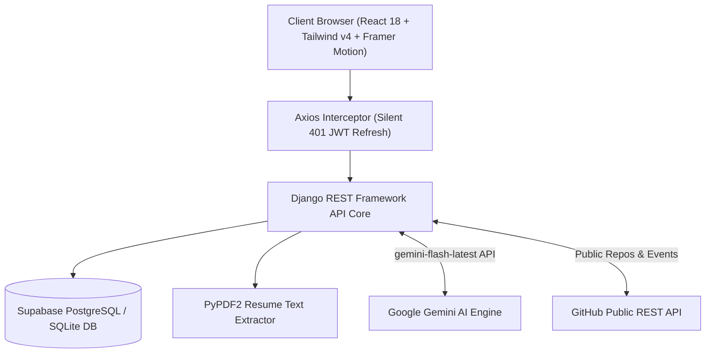

<div align="center">

  # ⚡ SkillForge AI
  ### Next-Generation AI Career Operating System for Software Engineers

  [](https://www.python.org/)
  [](https://www.djangoproject.com/)
  [](https://react.dev/)
  [](https://ai.google.dev/)
  [](https://tailwindcss.com/)
  [](https://vitejs.dev/)
  [](https://www.docker.com/)

  <p align="center">
    <strong>SkillForge AI</strong> is an autonomous, full-stack AI career operating system built for software developers, engineers, and CS students. It evaluates your multidimensional skills, parses PDF resumes for ATS scoring, aggregates public GitHub commit evidence, generates skill-targeted project blueprints, and conducts interactive AI mock interviews.
  </p>

  [Features](#-all-features) • [Architecture](#-system-architecture) • [Run on Your Machine](#-how-to-run-on-your-machine) • [API Reference](#-api-reference)

</div>

---

## 🔥 All Features

| Feature | Description | Gemini AI Cost |
|---|---|---|
| 🧠 **Career DNA Engine** | Multidimensional evaluation mapping your strengths against target job roles | **Cached in DB** ($0 on revisit) |
| ⚡ **Skill Gap Diagnostics** | Analyzes missing market skills and prioritizes high-impact learning targets | **Cached in DB** ($0 on revisit) |
| 🐙 **GitHub Intelligence** | Fetches repos, stars, language breakdowns, and contribution streaks | **Cached 24h** ($0 on revisit) |
| 📄 **Resume ATS Engine** | PyPDF2 text extraction + ATS readiness scoring & bullet-point tips | **Cached in DB** ($0 on revisit) |
| 🎤 **Mock Interview AI** | Interactive voice/text simulator scoring technical accuracy & clarity | **Per session** (~7 calls) |
| 🛠️ **AI Derived Projects** | Skill-targeted project blueprints derived locally from skill gaps | **Zero API Cost ($0)** |
| 🗺️ **Learning Roadmap** | Weekly milestone timelines connecting courses, builds, and proof tasks | **Cached in DB** ($0 on revisit) |
| 🎨 **Global Design System** | High-contrast Token-based Light Mode 🌞 & Dark Mode 🌙 switching | **Client-side** ($0) |

---

## 🏗️ System Architecture

For full layer-by-layer documentation, view our [ARCHITECTURE.md](file:///Users/rajchaudhary/createmindai/CareerMind-A/ARCHITECTURE.md).



---

## 💻 How to Run on Your Machine

You can run SkillForge AI using either **Standard Local Setup** or **Docker Setup**.

---

### Method A: Standard Local Setup (Recommended for Development)

#### 1. Clone the Repository
```bash
git clone https://github.com/XCHAUDHARY00/CareerMind-A.git
cd CareerMind-A
```

#### 2. Backend Setup (Django REST Framework)
```bash
# Navigate to backend directory
cd backend

# Create Python virtual environment
python3 -m venv venv

# Activate virtual environment
# On macOS/Linux:
source venv/bin/activate
# On Windows:
# venv\Scripts\activate

# Install Python dependencies
pip install -r requirements.txt

# Create .env file inside backend directory
cat <<EOT > .env
SECRET_KEY=django-insecure-development-key-change-in-production
DEBUG=True
GEMINI_API_KEY=your_google_gemini_api_key_here
EOT

# Run Database Migrations
python manage.py makemigrations
python manage.py migrate

# Start Django Development Server
python manage.py runserver
```
Backend server will run at: **`http://127.0.0.1:8000/`**

#### 3. Frontend Setup (React + Vite)
Open a new terminal window:

```bash
# Navigate to frontend directory
cd frontend

# Install Node dependencies
npm install

# Start Vite Development Server
npm run dev
```
Frontend app will run at: **`http://localhost:5173/`**

---

### Method B: Docker Setup (Recommended for Production / 1-Click Launch)

```bash
# Create root .env file
cat <<EOT > .env
GEMINI_API_KEY=your_google_gemini_api_key_here
EOT

# Build and launch both Backend & Frontend containers
docker-compose up --build
```
- Access Frontend UI: **`http://localhost:5173`**
- Access Backend API: **`http://localhost:8000`**

---

## 📑 API Reference

| Method | Endpoint | Request Payload Example | Response Example / Details | Auth |
|---|---|---|---|---|
| `POST` | `/api/register/` | `{"username": "dev", "email": "a@b.com", "password": "xxx"}` | `{"status": "success", "tokens": {...}}` | No |
| `POST` | `/api/login/` | `{"username": "dev", "password": "xxx"}` | `{"access": "ey...", "refresh": "ey..."}` | No |
| `POST` | `/api/token/refresh/` | `{"refresh": "ey..."}` | `{"access": "ey..."}` | No |
| `GET` | `/api/myprofile/` | *None* | User Profile object, `career_xp`, `streak`, `readiness_score` | Yes |
| `PATCH` | `/api/profile/update/` | `{"bio": "Dev", "experience": "2 yrs"}` | `{"status": "success"}` | Yes |
| `GET` | `/api/carrer-dna/` | *None* | Career DNA radar scores, role matches, AI summary | Yes |
| `GET` | `/api/skills_gap/` | *None* | Skill gaps, priorities, required vs current levels | Yes |
| `GET` | `/api/roadmap/` | *None* | 4-week step-by-step milestone learning plan | Yes |
| `POST` | `/api/github/link/` | `{"username": "octocat"}` | `{"status": "success", "username": "octocat"}` | Yes |
| `DELETE` | `/api/github/unlink/` | *None* | `{"status": "success"}` | Yes |
| `GET` | `/api/github/analyze/` | *None (`?force=true` optional)* | Repos, stars, language breakdown, commit streak, AI rating | Yes |
| `POST` | `/api/resume/upload/` | `multipart/form-data: resume (PDF)` | ATS readiness score, breakdown, AI improvement tips | Yes |
| `GET` | `/api/resume/analysis/` | *None* | Cached resume ATS analysis | Yes |
| `POST` | `/api/linkedin/link/` | `{"url": "https://linkedin.com/in/..."}` | `{"status": "success"}` | Yes |
| `POST` | `/api/interview/start/` | `{"target_role": "Backend Developer", "difficulty": "Medium"}` | `{"session_id": 1, "first_question": "..."}` | Yes |
| `POST` | `/api/interview/answer/` | `{"session_id": 1, "answer_text": "..."}` | `{"next_question": "...", "ai_feedback": "..."}` | Yes |
| `POST` | `/api/interview/end/` | `{"session_id": 1}` | Final technical & communication score summary | Yes |

---

<div align="center">
  <p>Built with ❤️ by Developers for Developers.</p>
</div>
