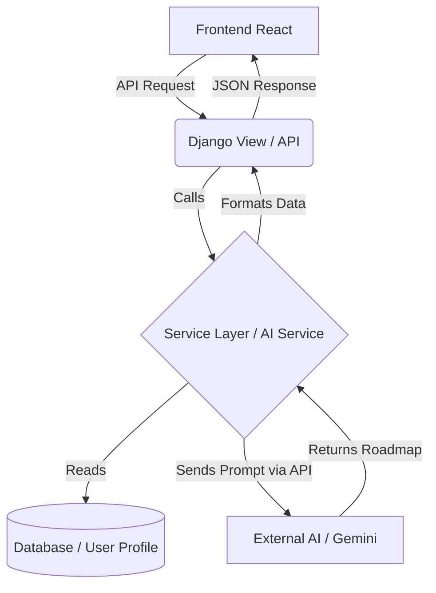

# 🤖 DAY 10: AI Integration Architecture (The Core Magic)

Bhai, ab hum us phase mein hain jiske liye humne ye poora app banaya hai—**CareerMind AI** ka asli dimaag! 
AI ko apne system mein jodna (integrate karna) itna mushkil nahi hai jitna lagta hai, par isko "sahi tarike" se banana zaroori hai.

Chal samajhte hain ki ye kaam kaise karega.

---

## 1. AI Integration Hota Kya Hai? 🧠

AI Integration ka matlab ye nahi ki hum apna khud ka ChatGPT bana rahe hain. Hum pehle se banaye gaye powerful AI (jaise Google ka Gemini ya OpenAI ka ChatGPT) ko "kiraye par" (API ke through) use karte hain.

**Flow of AI Integration:**
1. **Gather Data:** Hum user ki profile (Skills, Education, Career Goals) apne database se nikalenge.
2. **Build a Prompt:** Ek lamba sa paragraph (Prompt) banayenge jisme likha hoga: *"Tum ek expert career counselor ho. Is user ki profile dekho aur iske target goal tak pahunchne ka step-by-step roadmap do."*
3. **Call the API:** Ye prompt hum AI (Gemini/OpenAI) ko bhejenge.
4. **Receive & Parse Data:** AI humein result dega (roadmap aur suggestions). Hum is data ko JSON mein badal kar apne frontend (Dashboard) par dikha denge.

---

## 2. Django "Service Layer" Architecture 🏗️

Django mein by default MVT (Model-View-Template) hota hai. Par jab hum AI API call karte hain, toh View ke andar lamba code likhna **gandi aadat (Bad Practice)** mani jati hai (Jise hum "Fat Views" kehte hain).

Isliye hum ek naya layer banate hain jise **Service Layer** kehte hain.

**Kyun banate hain?**
Views ka kaam sirf HTTP request lena aur response dena hota hai. Logic (jaise AI se baat karna, data format karna) Service Layer mein hona chahiye. Agar kal ko humein AI API change karni padi (OpenAI se Gemini par shift hona), toh humein Views change nahi karna padega, sirf Service Layer change hoga.



---

## 3. The Recipe: Prompt Engineering 📝

AI ko use karna ek kala (art) hai. Agar tum AI ko doge: "Give roadmap for Python developer", toh wo ek basic sa jawab dega.
Humein ek **System Prompt** banana hoga jo AI ka character set karega.

**Our Magic Prompt Structure:**
```text
System: You are an elite tech career coach. Always respond in valid JSON format.
Context: 
- User's Goal: {goal.title}
- Current Experience: {profile.experience}
- Known Skills: {skills}

Task: Generate a 3-step learning roadmap to bridge the gap between known skills and the goal.
Output format: {"roadmap": [{"step": 1, "action": "...", "resources": ["..."]}]}
```
(Aise prompt se AI humesha ek structured JSON dega, jisko frontend asani se cards mein dikha payega!)

---

## 4. Next Action Plan (Tu kya code likhega) 🛠️

Jab tu code likhne baithega, toh steps ye honge:
1. **API Key Lana:** Google Gemini ya OpenAI platform par jaakar API key generate karna, aur use `.env` file mein chupana (e.g., `GEMINI_API_KEY=xxx`).
2. **Install SDK:** `pip install google-generativeai` (Agar Gemini use karein).
3. **Create `services.py`:** Apne `users` app ke andar `services.py` file banana aur usme AI se baat karne ka function likhna.
4. **Create API View:** Ek nayi view banana `/api/generate-roadmap/` jo `services.py` ko call karegi.

---

## 🎤 TOP 10 INTERVIEW QUESTIONS (AI Integration & Architecture)

**Q1. View Layer me complex logic kyu nahi likhna chahiye? (Fat Models vs Fat Views)**
**Ans:** View ka main purpose request routing aur response handling hona chahiye. Agar sara API logic (e.g. AI calls, complex calculations) View me likh diya, toh code test karna mushkil ho jata hai aur re-usability khatam ho jati hai. Isliye Business logic ko Service layer (services.py) me likhna best practice hai.

**Q2. AI API ko call karte waqt timeout errors kaise handle karte hain?**
**Ans:** AI APIs kabhi-kabhi response dene me 10-20 seconds laga sakti hain. Isliye hum API requests me `timeout` parameter set karte hain. Aur code me `try...except` block lagate hain (jaise `requests.exceptions.Timeout`) taaki agar AI time le toh server crash hone ki bajaye user ko "Please try again later" ka message de sake.

**Q3. System Prompt aur User Prompt me kya farq hota hai (LLMs me)?**
**Ans:** System Prompt AI ka behaviour, role aur boundaries set karta hai (e.g. "Tum ek senior software engineer ho, sirf Python code do"). User prompt actual sawal ya context hota hai jo user poochta hai. System prompt API call me sabse top par bheja jata hai highest priority ke sath.

**Q4. AI APIs ko free ya trial me use karte waqt "Rate Limiting" (429 Error) kaise bachate hain?**
**Ans:** Hum API ko dhada-dhad call nahi kar sakte warna wo hume block kar denge (e.g., max 15 requests/minute). Isse bachne ke liye hum Backend me Caching (Redis) lagate hain. Agar 2 users ne same cheez mangi, toh doosre user ko cached data de dete hain bina API call kiye. Ya phir requests ko queue (Celery) me daal kar thoda slow process karte hain.

**Q5. Agar AI JSON format ki jagah normal text return karde toh app phat jayegi. Ise kaise rokein?**
**Ans:** Ye hallucination ka issue hai. Isko rokne ke 2 tarike hain: 1) Prompt me strictly likhna "Output MUST be valid JSON". 2) Aajkal naye models (OpenAI/Gemini) me `response_format={ "type": "json_object" }` pass karne ka option hota hai jo unko force karta hai valid JSON hi return karne ko.

**Q6. SDK (Software Development Kit) kya hota hai?**
**Ans:** SDK ek pre-written library hoti hai jo companies (jaise Google/OpenAI) provide karti hain. Hum direct HTTP/Axios/Requests se bhi unki API call kar sakte hain, par SDK un calls ko aasan functions me wrap kar deta hai, e.g., `model.generate_content("Hello")`, taaki hume raw API ke headers aur urls khud manage na karne pade.

**Q7. "Hallucination" in AI kya hota hai?**
**Ans:** Jab AI bahut confidently galat, fake ya non-existent information deta hai, toh use Hallucination kehte hain. Isse bachne ke liye AI ko strong context (tumhari skills aur limitations) dena padta hai.

**Q8. Service Layer pattern use karne se testing me kya fayda hota hai?**
**Ans:** Hum Service Layer function ko isolated tarike se test kar sakte hain (Unit Testing) bina poore Django HTTP pipeline (request/response) ko invoke kiye. Hum AI calls ko aasani se "Mock" bhi kar sakte hain taaki testing ke dauran asli paise (API calls) kharch na hon.

**Q9. API Key ko `.env` me rakhne ke baad use code me kaise padhte hain Python me?**
**Ans:** Hum `python-dotenv` aur `os` module ka use karte hain. Jaise: `import os; API_KEY = os.getenv('GEMINI_API_KEY')`. Ya fir Django-environ package ka use karke apne `settings.py` me load kar lete hain.

**Q10. AI integration me Asynchronous programming (async/await) backend me kyu zaroori hoti hai?**
**Ans:** AI API call network-bound hoti hai (I/O operation). Agar framework synchronous hai, toh jab tak AI reply nahi karta, poora thread block ho jata hai aur doosre users ki request wait karti hain. `async` use karne se server doosre requests process kar sakta hai jab tak AI soch raha hota hai.
