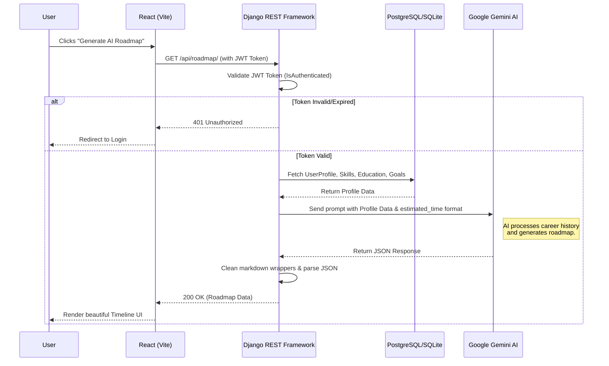

# 🏆 Day 11: Final Architecture, CRUD, & Interview Mastery

Congratulations! We have successfully built **CareerMind AI** - a full-stack AI-powered career coach.

## 🏗️ 1. Complete Architecture Flow Diagram

Below is the complete Mermaid diagram illustrating how data flows from the React Frontend to the Django Backend, to the Gemini AI, and back to the User.



## 🛠️ 2. Core Concepts Covered

1. **Django REST Framework (DRF):** 
   - Token-based Authentication (`rest_framework_simplejwt`).
   - CRUD Operations (`GET`, `POST`, `PUT`, `PATCH`, `DELETE`).
   - Object-Relational Mapping (ORM) and complex models (`OneToOneField`, `ForeignKey`, `ManyToManyField`).
   - `Serializer` validation and data formatting.

2. **React (Vite) Frontend:**
   - React Router DOM for protected routes (`<ProtectedRoute>`).
   - Axios Interceptors for global error handling (auto-logout on 401).
   - State management (`useState`, `useEffect`).
   - Advanced UI using Tailwind CSS (Glassmorphism, Gradients, Animations).

3. **AI Integration:**
   - Google Generative AI (Gemini 2.5).
   - Prompt Engineering (Forcing AI to output strictly structured JSON without markdown).

## 🎤 3. Top Interview Questions (Full-Stack & AI)

### Q1. How do you handle authentication in a decoupled React-Django application?
**Answer:** We use JWT (JSON Web Tokens). When a user logs in, Django generates an `access` and `refresh` token. The React frontend stores the token in `localStorage`. For every protected API call, React attaches the token in the `Authorization: Bearer <token>` header using an Axios Request Interceptor. If the token expires, our Response Interceptor catches the `401 Unauthorized` error and automatically redirects the user to the login page.

### Q2. How did you structure your database relationships for the user profile?
**Answer:** 
- The `UserProfile` has a `OneToOneField` with the default Django `User` model, acting as an extension of the user.
- `Skills` have a `ManyToManyField` with `UserProfile` because a user can have many skills, and a skill (like "Python") can belong to many users.
- `Education` and `CareerGoal` have a `ForeignKey` (One-To-Many) pointing to `UserProfile`, since one user can have multiple education entries, but an education entry belongs exclusively to that user.

### Q3. When calling an external AI API (like Gemini), how do you ensure the backend doesn't crash if the AI returns malformed data?
**Answer:** We wrap the AI call in a `try...except` block. Furthermore, LLMs often wrap JSON responses in markdown backticks (````json ... ````). We manually clean the string using Python's string manipulation (`.strip()`, `.startswith()`) before passing it to `json.loads()`. If parsing fails, the backend catches the `JSONDecodeError` and gracefully returns a 500 error to the frontend, which displays a user-friendly "Try Again" message instead of crashing the app.

### Q4. What is the difference between PUT and PATCH in REST APIs?
**Answer:** `PUT` replaces the entire resource. If a field is missing in the request, it gets set to null or default. `PATCH` is for partial updates; it only updates the fields provided in the payload and leaves the rest unchanged. In our app, updating the profile uses `PATCH`, while updating a specific Education entry uses `PUT`.

### Q5. How does your frontend manage state while waiting for the AI response?
**Answer:** We use a `loading` state variable initialized to `false`. When the "Generate" button is clicked, we set `loading` to `true`, which renders a custom CSS spinner animation. Once the API call resolves (either success or error), we use the `finally` block in our `try...catch` to set `loading` back to `false`.
