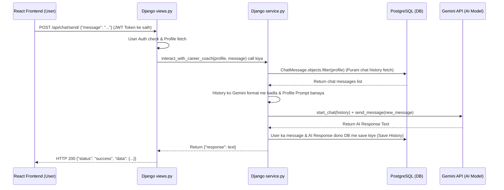

# 🚀 Day 12: Context-Aware AI Chat & Chat History Saving

Bhai, abhi tak apan ne kya kiya? Humne user ki profile aur goal se data uthake Gemini ko bheja, aur Gemini ne ek mast roadmap bana kar de diya. 

Ab hume banana hai **AI Career Chat**!
Ye chat aam chat nahi hogi. Ye hogi **Context-Aware** chat.

---

## 1. Context-Aware Chat kya hoti hai? (What is it?)
Socho, agar tum ChatGPT se baat kar rahe ho aur tumne bola:
1. *User*: "Main Django seekhna chahta hu."
2. *AI*: "Bahut achha! Django seekhne ke liye Python aani chahiye."
3. *User*: "Iske best frameworks kaunse hain?"

Agar AI ko purani baat yaad nahi hogi (Context nahi pata hoga), toh wo confuse ho jayega ki *"Iske"* ka kya matlab hai (Django ya Python?).
**Context-Aware** ka matlab hai ki AI ko user ki **Profile** (skills, experience) aur **Conversation History** (purani baatein) dono yaad rahein taaki wo sahi jawab de sake.

---

## 2. Hum ye kaise karenge? (Architecture)

Hum do kaam karenge:
1. **Database me Chat Save karenge**: Ek `ChatMessage` Model banayenge jo user ki har chat ko database me store karega.
2. **Gemini ko History bhejenge**: Jab bhi user naya message bhejega, hum database se uski purani chat history nikalenge, use Gemini ke `chat.send_message()` format me convert karenge, aur fir Gemini se response mangwayenge.

---

## 3. Database Model Design (`models.py`)

Apan ek `ChatMessage` model banayenge. Isme kya kya fields honge?
* `user_profile`: Kis user ki chat hai.
* `sender`: Message kisne bheja? `user` ne ya `ai` ne? (Taaki hum differentiate kar sakein).
* `message`: Asli message text.
* `timestamp`: Message kab bheja gaya (taaki order maintain rahe).

Chalo model ka structure dekhte hain:

```python
class ChatMessage(models.Model):
    SENDER_CHOICES = [
        ('user', 'User'),
        ('ai', 'AI'),
    ]
    
    user_profile = models.ForeignKey(
        UserProfile, 
        on_delete=models.CASCADE, 
        related_name="chat_messages"
    )
    sender = models.CharField(max_length=10, choices=SENDER_CHOICES)
    message = models.TextField()
    timestamp = models.DateTimeField(auto_now_add=True)

    def __str__(self):
        return f"{self.sender}: {self.message[:30]}..."
```

---

## 4. AI Chat History ko Gemini ke format me convert karna

Gemini API ek special format mangta hai history ke liye. Usko content structure chahiye hota hai:
```python
history = [
    {'role': 'user', 'parts': ['Hi, I need career advice.']},
    {'role': 'model', 'parts': ['Hello! I am your AI career coach. How can I help?']}
]
```
*Note: Gemini me AI ke role ko `'model'` likhte hain.*

Hum kya karenge? 
1. Database se user ke purane messages fetch karenge (e.g., `ChatMessage.objects.filter(user_profile=profile).order_by('timestamp')`).
2. Unhe is format me transform karenge.
3. Gemini ka chat session start karenge: `chat = model.start_chat(history=formatted_history)`.
4. Naya message bhejenge: `response = chat.send_message(user_new_message)`.
5. User ka message aur AI ka response database me save kar denge.

---

## 5. Progress Report (Status)
- [x] **Step 1**: `users/models.py` me `ChatMessage` model add kar diya.
- [x] **Step 2**: Database migrations run kar li (`makemigrations` aur `migrate` DONE).
- [ ] **Step 3**: `users/service.py` me `interact_with_career_coach` function likhna (In progress).
- [ ] **Step 4**: API View banana.

---

## 6. Service Code (`users/service.py`)

Apan `users/service.py` me ye function daalenge jo database se history nikalkar Gemini ko dega aur reply wapas save karega:

```python
def interact_with_career_coach(user_profile, new_message):
    """
    Ye function user ki profile, chat history fetch karega aur Gemini se chat continue karega.
    """
    from .models import ChatMessage  # Circular import se bachne ke liye andar import kiya
    
    # 1. API Key set karo
    api_key = os.getenv("GEMINI_API_KEY")
    if not api_key:
        return {"error": "API Key is missing!"}
    genai.configure(api_key=api_key)
    
    # 2. Database se is user ki purani chat history fetch karo (Purane messages se naye ki taraf)
    chat_history = ChatMessage.objects.filter(user_profile=user_profile).order_by('timestamp')
    
    # 3. Chat history ko Gemini ke format me convert karo
    formatted_history = []
    for msg in chat_history:
        role = 'user' if msg.sender == 'user' else 'model'
        formatted_history.append({
            'role': role,
            'parts': [msg.message]
        })
    
    # 4. User Profile ke hisab se AI ko prompt instruction do (System Instruction)
    skills = [skill.name for skill in user_profile.skills.all()]
    skills_text = ", ".join(skills) if skills else "No skills added yet"
    latest_goal = user_profile.user_career_goals.last()
    goal_title = latest_goal.title if latest_goal else "General Career Growth"
    goal_desc = latest_goal.description if latest_goal else ""
    
    system_instruction = f"""
    You are an elite AI Career Coach named "CreateMind AI Coach". 
    Your goal is to guide the user on their career path, answer career-related questions, and help them achieve their goals.
    
    User Profile Context:
    - Experience Level: {user_profile.experience}
    - Known Skills: {skills_text}
    - Target Career Goal: {goal_title} ({goal_desc})
    
    Give professional, practical, and highly motivating answers. Keep your answers brief, clean, and conversational. Do NOT use markdown code blocks for normal chat responses.
    """
    
    # 5. Gemini Model initialize karo with System Instruction
    model = genai.GenerativeModel(
        'gemini-2.5-flash',
        system_instruction=system_instruction
    )
    
    # 6. Gemini Chat session start karo purani history ke sath
    chat = model.start_chat(history=formatted_history)
    
    try:
        # 7. AI ko naya message bhejo aur response lo
        response = chat.send_message(new_message)
        ai_response_text = response.text.strip()
        
        # 8. Dono messages database me save karlo
        ChatMessage.objects.create(
            user_profile=user_profile,
            sender='user',
            message=new_message
        )
        ChatMessage.objects.create(
            user_profile=user_profile,
            sender='ai',
            message=ai_response_text
        )
        
        return {"response": ai_response_text}
        
    except Exception as e:
        print("Chatbot Error:", str(e))
        return {"error": "Failed to get response from AI Coach. Please try again."}
```

---

## 7. Chat Message Serializer (`users/serializers.py`)

Humne `serializers.py` me ye class add ki hai taaki chat history ko safely JSON format me convert karke api response me bhej sakein:

```python
from .models import ChatMessage

class ChatMessageSerializer(serializers.ModelSerializer):
    class Meta:
        model = ChatMessage
        fields = ['id', 'sender', 'message', 'timestamp']
```

---

## 8. View APIs (`users/views.py`)

Humne `views.py` me 2 naye endpoints add kiye hain:
1. `send_chat_message` (POST): AI se chat karne ke liye.
2. `get_chat_history` (GET): Chat history wapas frontend pe load karne ke liye.

```python
@api_view(['POST'])
@permission_classes([IsAuthenticated])
def send_chat_message(request):
    """
    User naya message bhejega, hum AI se reply mangwayenge aur response denge.
    """
    message = request.data.get("message")
    if not message:
        return Response({"status": "error", "message": "Message is required"}, status=status.HTTP_400_BAD_REQUEST)
        
    try:
        from .service import interact_with_career_coach
        profile = request.user.profile
        ai_data = interact_with_career_coach(profile, message)
        
        if "error" in ai_data:
            return Response({"status": "error", "message": ai_data["error"]}, status=status.HTTP_500_INTERNAL_SERVER_ERROR)
            
        return Response({
            "status": "success",
            "message": "Response received",
            "data": {
                "response": ai_data["response"]
            }
        }, status=status.HTTP_200_OK)
    except Exception as e:
        return Response({"status": "error", "message": str(e)}, status=status.HTTP_500_INTERNAL_SERVER_ERROR)


@api_view(['GET'])
@permission_classes([IsAuthenticated])
def get_chat_history(request):
    """
    User ki purani chat history return karega.
    """
    try:
        profile = request.user.profile
        messages = ChatMessage.objects.filter(user_profile=profile).order_by('timestamp')
        serializer = ChatMessageSerializer(messages, many=True)
        return Response({
            "status": "success",
            "data": serializer.data
        }, status=status.HTTP_200_OK)
    except Exception as e:
        return Response({"status": "error", "message": str(e)}, status=status.HTTP_500_INTERNAL_SERVER_ERROR)
```

---

## 9. URL Mappings (`users/urls.py`)

Aakhiri me, humne inn dono views ko URL paths ke sath link kiya hai:

```python
path('chat/send/', views.send_chat_message, name="sendchat"),
path('chat/history/', views.get_chat_history, name="chathistory"),
```

---

## 10. System Architecture Diagram 📊

Humara context-aware chat system kis tarah data flow karta hai, is diagram se samajhte hain:



---

## 11. High-Probability Interview Questions (FAQs) 💼

Interview me is feature se related ye sawaal aksar puche jaate hain:

### Q1: AI ko purani baatein kaise yaad rehti hain? (How is it context-aware?)
* **Answer**: AI stateless hota hai (wo khud kuch yaad nahi rakhta). Humne **Database-backed history injection** use kiya hai. Jab bhi user naya message bhejta hai, hum database se uski purani chat history fetch karte hain, use Gemini ke structure me list banate hain, aur `model.start_chat(history=...)` ke zariye Gemini ko pass karte hain. AI ko lagta hai hum usi purani chat session me hain.

### Q2: Agar chat history bohot badi ho jaye, toh kya issue hoga? Aur solution kya hai?
* **Answer**: Do bade issues aayenge:
  1. **Token Cost Increase**: Har baar message bhejte waqt saare purane messages bhi bhej rahe hain, toh Gemini API ke tokens bohot zyada consume honge.
  2. **Context Window Limit**: AI models ki ek limit hoti hai (max context length). Agar chat bohot lambi chali toh ye window overflow ho jayegi.
* **Solution**: Hum **History Truncation** use karenge. Hum poori history bhejney ke bajaye database se sirf aakhiri 15-20 messages hi bhejenge: 
  `ChatMessage.objects.filter(user_profile=profile).order_by('-timestamp')[:20]` (aur is list ko reverse karke Gemini ko pass karenge).

### Q3: AI ko user ke skills aur career goal bina har baar type kiye kaise pata chalta hai?
* **Answer**: Hum **Dynamic System Instructions** use kar rahe hain. Har API call par backend database se user ki profile, skills aur active career goal nikalta hai aur use Gemini ke `system_instruction` parameter me inject karta hai. Ye instruction AI ko background rules deta hai ki use kis user profile ke mutabik jawab dena hai.

### Q4: Humne `from .models import ChatMessage` ko view ya service function ke andar import kyu kiya, file ke top par kyu nahi kiya?
* **Answer**: Django me **Circular Import Error** se bachne ke liye. Agar `models.py` service ko import kare aur `service.py` models ko top level par import kare, toh Python load hote waqt crash ho jata hai. Function ke andar import karne se module tabhi load hota hai jab function call ho.

---

## 12. Status check 🚀
- [x] **Step 1**: `users/models.py` me `ChatMessage` model add kiya.
- [x] **Step 2**: Database migrations run ki.
- [x] **Step 3**: `users/service.py` me `interact_with_career_coach` core logic function banaya.
- [x] **Step 4**: Serializer, View API endpoints, aur URL paths set kiye.
- [x] **Step 5**: React Frontend UI complete kiya aur backend se connect kiya.
- [x] **Step 6**: System Architecture & Interview Prep documentation complete.

