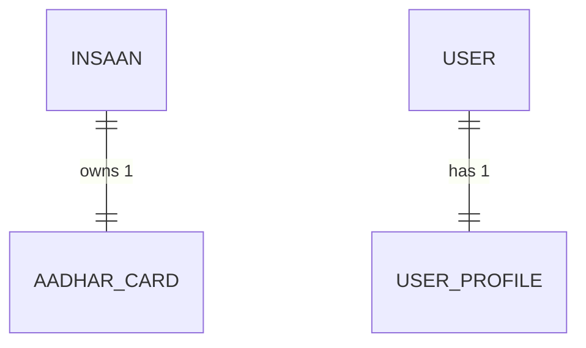
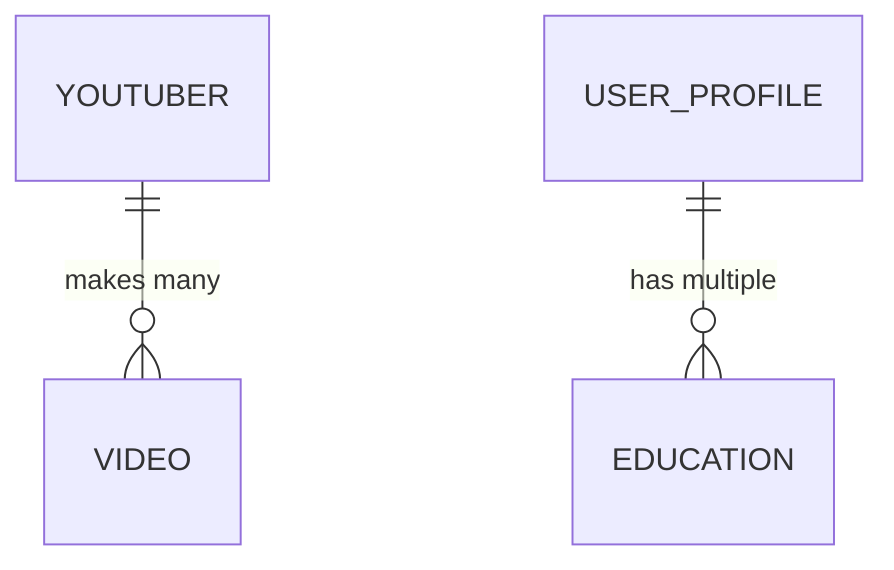
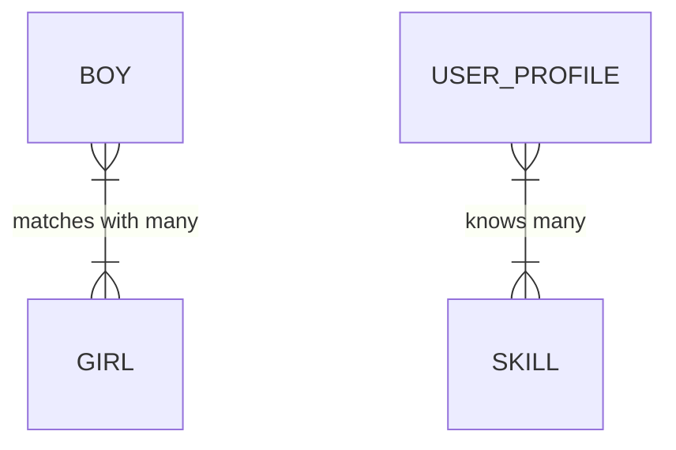

# 📅 DAY 6: Advanced Database Relationships 🚀 (Phase 4 Start)

Bhai, sorry yaar main bhool gaya tha ki tu khud code likhega aur main tera teacher hoon! Ab se main tera concept clear karunga, interview questions bataunga, aur tu code likhega. Code likhne ke baad mujhe check karne bolna, main bataunga sahi hai ya nahi.

Aaj hum apne database ka agla level unlock karne wale hain. Database Relationships samajhna backend developer banne ka sabse zaroori step hai. Aaj isko ekdum desi aur funny style mein samajhte hain!

---

## 1. Text Field kyu kharab hai? 🧠

Socho tumne apna `Skill` likha "Python", kisi aur ne likha "python", teesre ne likha "pytHOn". Ab kal ko mujhe nikalna hai ki "Python" kis kis ko aata hai, toh database pagal ho jayega spelling match karte karte! 
Isliye hum skills ko ek alag table (model) mein daal dete hain, aur user ko us se "Link" (Relationship) kar dete hain.

---

## 2. Types of Relationships in Django 🔗 (Real-Life Funny Examples)

Bhai database relationships bilkul real-life rishton ki tarah hote hain. Interviewer pooche toh bas ye examples yaad rakhna!

### A. One-to-One Relationship (`models.OneToOneField`)
**Concept:** Ek ka sirf ek se rishta. Na idhar zayada, na udhar.
**Funny Example:** Ek **Aadhar Card** sirf ek **Insaan** ka ho sakta hai. Aur ek Insaan ka sirf ek hi Aadhar Card hoga. (Fake waale count nahi kar rahe 😂).
Ya phir, jaise humara app hai: Ek `User` (login detail) ka ek hi `UserProfile` (bio, experience) hoga.

### B. One-to-Many Relationship (`models.ForeignKey`)
**Concept:** Ek side akela hai, par doosri side bohot saare hain. (Note: Django mein isko `ForeignKey` bolte hain).
**Funny Example:** Ek **Youtuber** aur uske **Videos**. CarryMinati ek hai, par uske channel pe bohot saare videos hain. Lekin koi ek specific video (e.g. "TikTok vs YouTube") sirf CarryMinati ka hi hai, Bhuvan Bam ka nahi!
**Our App Example:** Ek User (UserProfile) ki bohot saari Education ho sakti hai (10th, 12th, B.Tech). 

### C. Many-to-Many Relationship (`models.ManyToManyField`)
**Concept:** Bohot saaro ka bohot saaro se connection. (Sabka sabse rishta!)
**Funny Example:** **Tinder Matches** ya **Netflix Movies**. 
Ek bnda bohot saari ladkiyo ko right swipe (like) kar sakta hai. Aur ek ladki bohot saare bndo ki like list mein ho sakti hai! 
**Our App Example:** Ek User ko bohot saari **Skills** aati hain (Python, React). Aur ek **Skill** (jaise Python) bohot saare Users ko aati hogi.

---

## 3. Aaj ka Tera Task 💻 (Tu code likhega, main check karunga)

Tujhe `backend/users/models.py` mein ye changes karne hain:

1. **Skill Model bana:** Naya model `Skill` bana jisme sirf `name` field hoga (`CharField`).
2. **Education Model bana:** Naya model `Education` bana. Isme ek `models.ForeignKey` laga jo `UserProfile` se connect ho (ki ye education kiski hai). Baaki fields: `institution`, `degree`, `start_date`, `end_date`.
3. **CareerGoal Model bana:** Naya model `CareerGoal` bana. Isme bhi `models.ForeignKey` laga jo `UserProfile` se connect ho. Baaki fields: `title`, `description`, `target_date`.
4. **UserProfile ko Update kar:**
   - Purane wale `career_goal`, `education`, aur `skills` fields ko delete kar de (kyunki ab hum naye models use karenge).
   - Ek naya field bana: `skills = models.ManyToManyField(Skill, blank=True)`.

---

## 4. Interview Questions 🎤 (Ratt lena bhai)

**Q1: Difference between ForeignKey and ManyToManyField in Django?**
**Ans (Sirf english mein dena):** `ForeignKey` establishes a One-to-Many relationship, where one record in a table is linked to multiple records in another. `ManyToManyField` creates a Many-to-Many relationship, and behind the scenes, Django automatically creates a third "join table" to manage this complex relationship.

**Q2: What is `related_name` in ForeignKey?**
**Ans:** It is used for "Reverse Query". Agar Education model mein `related_name="education_history"` hai, toh hum UserProfile se direct uski saari education nikal sakte hain `user_profile.education_history.all()` likh kar. Ulta rasta aasaan kar deta hai!

**Q3: ForeignKey (One-to-Many) me `on_delete=models.CASCADE` ka kya matlab hai?**
**Ans:** Iska matlab hai ki agar Parent record (jaise `UserProfile`) database se delete ho jaye, toh usse jude hue saare Child records (jaise `Education` ya `CareerGoal`) bhi automatically delete ho jayenge, taaki database me koi kachra (orphan records) na bache.

**Q4: Django backend me Many-to-Many relationship actual database level par kaise handle hota hai?**
**Ans:** Relational databases (jaise PostgreSQL ya MySQL) natively Many-to-Many relationships support nahi karte. Isliye Django automatically background me ek **Teesri table (Join/Junction table)** create karta hai jo dono tables ki Primary Keys (IDs) ko aas me map karti hai.

**Q5: Model me `null=True` aur `blank=True` me kya farq hai?**
**Ans:** `null=True` database-level par kaam karta hai, iska matlab column me NULL value allowed hai. `blank=True` form-validation (frontend/admin) level par kaam karta hai, jiska matlab hai field ko khali (blank string/empty) chhodna allowed hai form submit karte waqt. String-based fields (CharField, TextField) me hamesha `blank=True` prefer kiya jata hai, `null=True` nahi, taaki empty values "khali string" ki tarah save hon na ki "NULL".

**Q6: ORM queries me `select_related()` aur `prefetch_related()` kya hote hain aur kab use hote hain?**
**Ans:** Ye dono Query optimization ke liye use hote hain (N+1 query problem solve karne ke liye). 
- `select_related()`: Ye One-to-One aur ForeignKey relationships ke liye hota hai. Ye SQL `JOIN` marta hai aur ek hi query me data nikal leta hai.
- `prefetch_related()`: Ye Many-to-Many aur reverse ForeignKey ke liye hota hai. Ye alag-alag queries run karke Python level par data ko join karta hai.

**Q7: Database indexing kya hoti hai aur Django model me kaise lagate hain?**
**Ans:** Indexing book ke index page ki tarah hoti hai. Agar kisi column par index laga ho, toh data read karna bohot fast ho jata hai par write thoda slow hota hai. Django me field me `db_index=True` pass karke ya `Meta` class me `indexes` define karke index lagate hain.

**Q8: Django models me `on_delete=models.SET_NULL` kab use karte hain?**
**Ans:** Jab hum nahi chahte ki Parent delete hone par Child delete ho. Example: Agar koi 'Employee' company chhod deta hai (User delete hota hai), toh hum uski banayi hui 'Sales Report' delete nahi karna chahte, bas uspe Employee ki ID ko NULL set karna chahte hain. Iske liye `null=True` bhi dena padta hai.

**Q9: Reverse relation ka data Serializer me kaise fetch karte hain?**
**Ans:** Ya toh hum `SerializerMethodField` banakar custom logic likhte hain (e.g. `obj.education_set.all()`), ya phir hum `related_name` ka use karke seedha dusre Serializer ko use kar sakte hain: `educations = EducationSerializer(many=True, read_only=True)`.

**Q10: "N+1 Query Problem" kya hoti hai Django ORM me?**
**Ans:** Agar main ek query se 10 users nikalu (1 query), aur phir har user ki profile access karu loop me (`user.profile.bio`), toh loop 10 aur queries chalayega (Total 11 queries for 10 records). Agar 1000 users hon toh 1001 queries challenge! Ise fix karne ke liye hum `.select_related('profile')` lagate hain, tab chahe 1000 records hon, sirf ek hi query chalti hai.

---

Bhai diagrams dekh ke samajh le. Phir jaake `models.py` mein code likh de. Jab tu likh lega, mujhe bolna **"check my models.py"**, main dekh ke bataunga sab perfect hai ya nahi! 🔥
